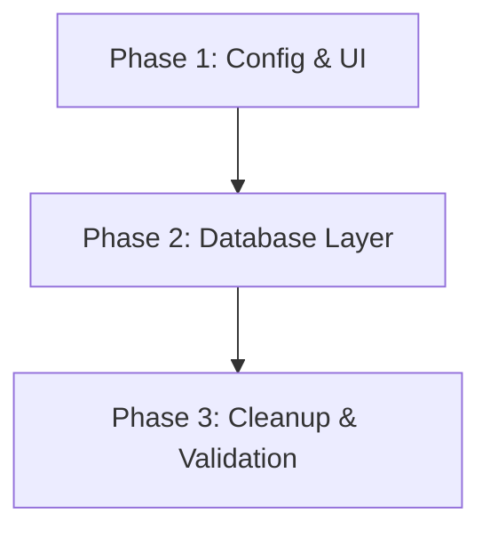

# Implementation Plan: Bestel-Tracker Cleanup (better-sqlite3)

## 1. Plan Overview
- **Total Phases**: 3
- **Agents Involved**: `refactor`, `coder`
- **Estimated Effort**: Medium
- **Primary Goal**: Reduce `node_modules` size from 224MB to < 100MB.

## 2. Dependency Graph

## 3. Execution Strategy Table
| Phase | Agent | Mode | Objective |
|-------|-------|------|-----------|
| 1 | `refactor` | Sequential | Replace Lucide icons with Emojis across 9 components. |
| 2 | `refactor` | Sequential | Replace Prisma with better-sqlite3 in server and scripts. |
| 3 | `coder` | Sequential | Remove dependencies, reinstall, and verify size. |

## 4. Phase Details

### Phase 1: Config & UI (Emoji/Unicode)
- **Objective**: Remove `lucide-react` dependency and replace all icons with Emojis. Update `package.json` scripts to remove `concurrently`.
- **Agent**: `refactor`
- **Files to Modify**:
    - `package.json`: Update `dev:all` script to `pnpm dev & pnpm server`.
    - `src/App.jsx`: Replace nav icons with Emojis.
    - `src/components/Dashboard.jsx`: Replace action icons with Emojis.
    - `src/components/WeeklyCard.jsx`: Replace stat icons with Emojis.
    - `src/components/HistoryWeeklyCard.jsx`: Replace stat icons with Emojis.
    - `src/components/HistoryView.jsx`: Replace calendar/download icons.
    - `src/components/ProductList.jsx`: Replace tag/clock icons.
    - `src/components/DeliveryForm.jsx`: Replace alert/check icons.
    - `src/components/DataManager.jsx`: Replace DB/file icons.
    - `src/components/ConsumptionForm.jsx`: Replace X icon.
    - `src/components/OrderForm.jsx`: Replace X icon.
- **Validation**:
    - `pnpm lint`
    - `pnpm build` (om te zien of er geen ontbrekende imports zijn)

### Phase 2: Database Layer (better-sqlite3)
- **Objective**: Transition from Prisma to `better-sqlite3` for all database operations.
- **Agent**: `refactor`
- **Files to Modify**:
    - `server/index.js`: Replace `PrismaClient` with `better-sqlite3` connection and rewrite all API endpoints (GET, POST, DELETE) to use SQL.
    - `scripts/cleanup-duration-depleted.js`: Rewrite cleanup logic to use SQL.
- **Implementation Details**:
    - Use `const db = require('better-sqlite3')('prisma/dev.db')`.
    - Ensure SQL queries match the current Prisma logic (joins for WeeklyStats, etc.).
- **Validation**:
    - Start server: `node server/index.js`
    - Verify API responses via `curl` or manual check.

### Phase 3: Cleanup & Validation
- **Objective**: Final removal of heavy dependencies and verification of schijfruimte.
- **Agent**: `coder`
- **Files to Modify**:
    - `package.json`: Remove `lucide-react`, `concurrently`, `prisma`, `@prisma/client`. Add `better-sqlite3`.
- **Validation**:
    - `rm -rf node_modules pnpm-lock.yaml`
    - `pnpm install`
    - `du -sh node_modules`
    - `pnpm dev:all` (verify app works)

## 5. File Inventory
| Phase | Action | Path | Purpose |
|-------|--------|------|---------|
| 1 | Modify | `package.json` | Replace concurrently with & |
| 1 | Modify | `src/App.jsx` | UI: Emojis |
| 1 | Modify | `src/components/*.jsx` | UI: Emojis (9 files) |
| 2 | Modify | `server/index.js` | Backend: better-sqlite3 |
| 2 | Modify | `scripts/cleanup-duration-depleted.js` | Scripts: SQL |
| 3 | Modify | `package.json` | Dependency cleanup |

## 6. Risk Classification
- **Phase 1**: LOW. Mostly string replacements.
- **Phase 2**: HIGH. SQL errors could break the app's core functionality.
- **Phase 3**: MEDIUM. Dependency conflicts during reinstall.

## 7. Execution Profile
- **Total phases**: 3
- **Parallelizable phases**: 0
- **Sequential-only phases**: 3
- **Estimated sequential wall time**: 15-20 minutes

## 8. Cost Estimation
| Phase | Agent | Model | Est. Input | Est. Output | Est. Cost |
|-------|-------|-------|-----------|------------|----------|
| 1 | `refactor` | Pro | 15K | 5K | $0.35 |
| 2 | `refactor` | Pro | 10K | 8K | $0.42 |
| 3 | `coder` | Flash | 5K | 2K | $0.02 |
| **Total** | | | **30K** | **15K** | **$0.79** |
